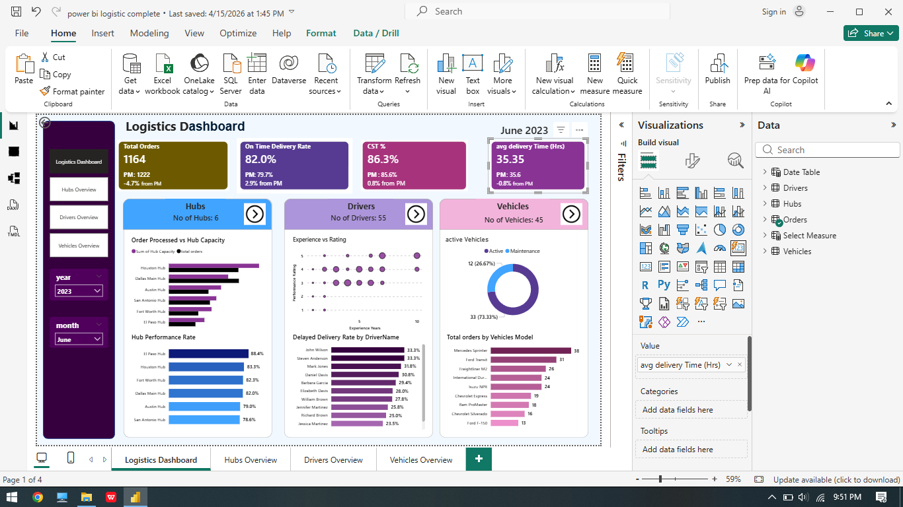
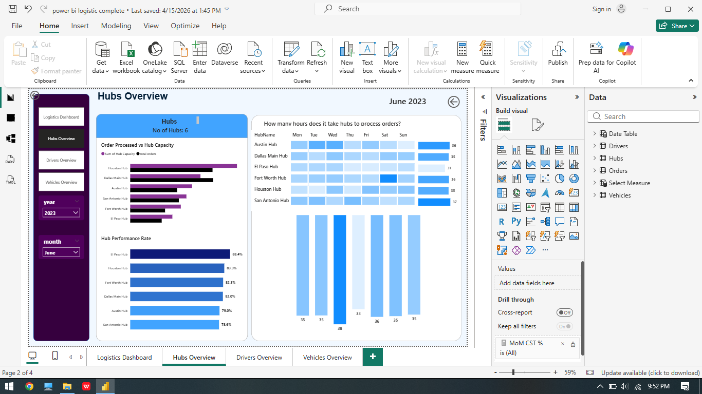
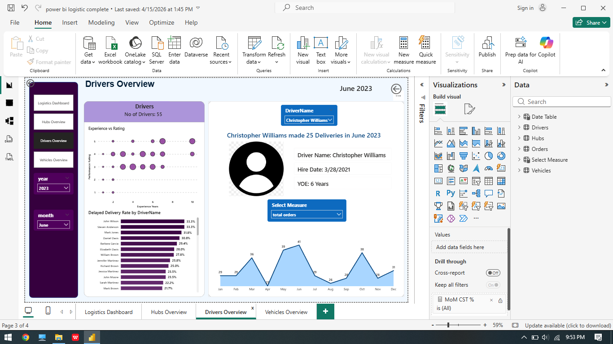
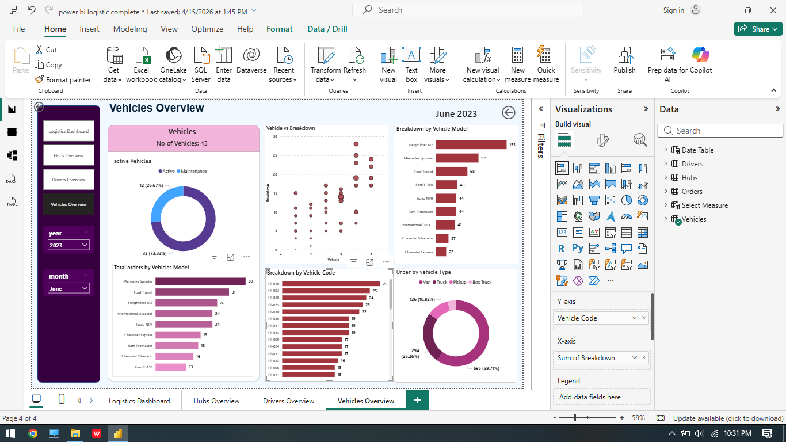

# Logistics Performance Dashboard | Power BI

## Overview

This Power BI project analyzes logistics operations and delivery performance.

The dashboard helps monitor:
- Order processing
- Delivery efficiency
- Driver performance
- Hub operations
- Vehicle utilization

The objective of this project is to identify operational bottlenecks and improve logistics efficiency.

---

## Tools Used

- Power BI
- DAX
- Power Query
- CSV Dataset

---

## Dashboard Pages

### Executive Dashboard
- Total Orders
- On-Time Delivery %
- Customer Satisfaction %
- Average Delivery Time

### Hubs Overview
- Orders processed by hubs
- Hub performance comparison
- Processing time analysis

### Drivers Overview
- Experience vs rating
- Delayed delivery analysis
- Driver monthly performance

### Vehicles Overview
- Active vs maintenance vehicles
- Vehicle utilization analysis
- Vehicle model breakdown

---

## Key Insights

- El Paso Hub achieved the highest performance rate.
- Vans handled the majority of deliveries.
- Average delivery time remained around 35 hours.
- Some experienced drivers still showed higher delay percentages.
- Route optimization
- Fleet maintenance analytics

## Future Improvements

- Real-time logistics tracking
- Predictive delay analysis

## Dashboard Preview

### Executive Dashboard

### Hubs Overview

### Drivers Overview

### Vehicles Overview

